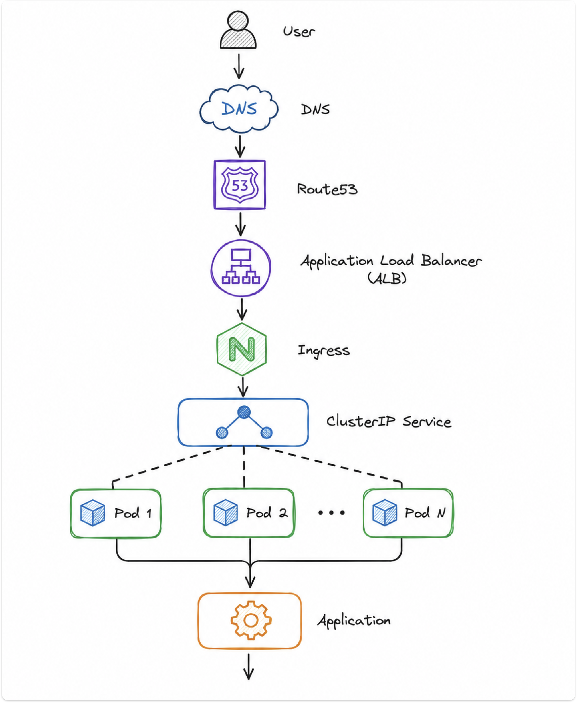

# Kubernetes, EKS & Docker Interview Q&A

## Q. Pod is Running but Application is Not Working?

If the Pod is in the Running state but the application is not working, I troubleshoot the issue step by step.

1. **Check Pod Status**
   - Run `kubectl get pods -n prod`.
   - Verify the Pod status, Ready status, and restart count.

2. **Check Pod Events**
   - Run `kubectl describe pod <pod-name>`.
   - Check for events such as Readiness probe failures, Liveness probe failures, image pull issues, or volume mount issues.

3. **Check Application Logs**
   - Run `kubectl logs <pod-name>`.
   - Look for database connection failures, missing environment variables, authentication errors, or application exceptions.

4. **Check Service and Endpoints**
   - Run `kubectl get svc`, `kubectl describe svc <service-name>`, and `kubectl get endpoints <service-name>`.
   - Verify the service port and selector labels.
   - If the Endpoints are empty, it means the Service is not able to discover the Pods.

5. **Verify Application Connectivity**
   - Connect to the Pod using `kubectl exec -it <pod-name> -- sh`.
   - Test connectivity using:
     - `curl` to verify the application endpoint.
     - `nslookup` to verify DNS resolution.
     - `netstat -tulpn` to verify listening ports.

6. **Check Configurations**
   - Verify ConfigMaps and Secrets.
   - Check for incorrect database URLs, environment variables, or secret values.

7. **Check Resource Usage**
   - Run `kubectl top pod`.
   - Verify CPU and memory utilization and check for OOMKilled events.

**Real-Time Example**

Recently, one of our microservice Pods was in the Running state, but users were receiving `503 Service Unavailable` errors.

I first checked the Pod status using `kubectl get pods` and noticed the Pod was `READY 0/1`. Then I ran `kubectl describe pod` and found that the Readiness Probe was failing.

After checking the application logs, I found that the application was trying to connect to Amazon RDS using an incorrect secret value. I updated the secret, restarted the deployment using `kubectl rollout restart deployment`, and the new Pods started successfully.

Once the Readiness Probe passed, the Service Endpoints were created automatically, and the application started serving traffic normally.

---

## How do you upgrade an EKS cluster with zero downtime?

In my project, we follow a phased approach to upgrade EKS clusters with zero downtime by upgrading the Dev environment first, followed by Stage, and finally Production. This helps us identify any compatibility issues before impacting production workloads. We always upgrade one Kubernetes minor version at a time (for example, 1.33 → 1.34).

**Steps**

1. **Check Compatibility**
   - Verify Kubernetes version support.
   - Verify EKS version compatibility.
   - Check VPC CNI compatibility.
   - Check CoreDNS compatibility.
   - Check kube-proxy compatibility.
   - Check EBS CSI Driver compatibility.
   - Check AWS Load Balancer Controller compatibility.

2. **Take Backups**
   - Take a Velero backup.
   - Backup the Terraform state.
   - Export Kubernetes manifests.
   - Backup critical configurations.

3. **Upgrade the EKS Control Plane**
   - Upgrade the EKS control plane to the next Kubernetes version.
   - The control plane upgrade is managed by AWS and does not affect running workloads.
   - During this process, the worker nodes continue serving traffic, so the application remains available.

4. **Upgrade EKS Add-ons**
   - Upgrade CoreDNS.
   - Upgrade kube-proxy.
   - Upgrade VPC CNI.
   - Upgrade the EBS CSI Driver to versions compatible with the new Kubernetes version.

5. **Upgrade the Managed Node Group (Critical for Zero Downtime)**
   - Create a new managed node group with the upgraded Kubernetes version alongside the existing node group.
   - Kubernetes automatically schedules Pods on the new nodes.
   - Drain the old nodes and remove the old node group after all Pods are running successfully.

6. **Validate the Upgrade**
   - Verify cluster health.
   - Verify Pods, Services, and Ingress.
   - Validate application functionality.
   - Once everything is verified, perform the same upgrade in the Stage and Production environments.

**Terraform Approach**

We manage our EKS clusters using Terraform. To upgrade Kubernetes, we update the cluster version in the Terraform code.

- Update the Kubernetes version in the Terraform configuration.
- Run `terraform plan` to review the changes.
- Run `terraform apply` to initiate the upgrade.
- AWS upgrades the EKS control plane first, followed by a rolling update of the managed node groups.
- Since our applications use multiple replicas, readiness probes, Pod Disruption Budgets (PDBs), and a Rolling Update strategy, the upgrade completes without downtime.

---

## How do you secure Kubernetes?

We secure Kubernetes at multiple levels to ensure the cluster, applications, and AWS resources remain secure.

**1. Cluster Access Security (RBAC)**
- We implement RBAC (Role-Based Access Control) using Roles, RoleBindings, ClusterRoles, and ClusterRoleBindings.
- RBAC controls what actions a user, group, or Service Account can perform within the Kubernetes cluster.

**2. IRSA (IAM Roles for Service Accounts)**
- We use IRSA so that applications can securely access AWS services without storing AWS credentials inside Pods.
- Service Account → IAM Role → AWS Services
- IRSA provides AWS authorization, while RBAC provides Kubernetes authorization.

**3. Least Privilege Principle**
- We follow the principle of least privilege by granting only the minimum permissions required for users, applications, and Service Accounts.

**4. Role-Based Access**
- We maintain separate access levels for Developers, DevOps Engineers, and Administrators based on their responsibilities.

**5. Network Security**
- We use Security Groups to control network access to the EKS cluster.
- Worker nodes are deployed in private subnets.
- We use Network Policies to control Pod-to-Pod communication within the cluster.

**6. Image and Code Security**
- We scan container images using Trivy to identify vulnerabilities.
- We perform static code analysis using SonarQube to detect bugs, vulnerabilities, and code quality issues.

**7. Logging and Monitoring**
- We continuously monitor the cluster and applications using monitoring and logging tools to detect and respond to security issues.

**8. Secrets Management**
- We store sensitive information in AWS Secrets Manager.
- Secrets are securely mounted into Pods using the Secrets Store CSI Driver, eliminating the need to store credentials inside container images or Kubernetes Secrets.

---

## How do you manage secrets and application configurations?

**Secrets**

In my current project running on AWS EKS, we use AWS Secrets Manager with the Secrets Store CSI Driver to securely manage application secrets. The Secrets Store CSI Driver fetches secrets from AWS Secrets Manager at runtime and mounts them securely inside the Pods.

**How Kubernetes uses secrets during runtime**

- Secrets are stored centrally in AWS Secrets Manager.
- **IRSA Authentication**: Each Pod's Service Account is mapped to an IAM Role using IRSA (IAM Roles for Service Accounts). This allows the Pod to securely authenticate to AWS and access only the required secrets.
- When the Pod starts, the Secrets Store CSI Driver fetches the secrets from AWS Secrets Manager and mounts them inside the Pod as a volume.
- The application reads the secrets from the mounted files.

**Flow:**

```
Pod Starts → Pod uses Service Account → Service Account assumes IAM Role via IRSA
→ IAM Role authorizes access to AWS Secrets Manager → Secrets Store CSI Driver
retrieves the secrets → Secrets are mounted inside the Pod → Application reads the secrets
```

No AWS access keys or credentials are stored inside the Pods.

**Application Configurations**

For non-sensitive data, we use Kubernetes ConfigMaps.

ConfigMaps store:

- Environment name
- Application URLs
- Key-value pairs
- Application configurations
- Port numbers

These configurations are managed through Helm values files for each environment. We use the same Helm chart for Dev, Stage, and Production, while only the values files change based on the environment.

---

## How do you validate deployments and ensure zero downtime?

**Deployment Validation**

After every deployment, I validate the deployment at multiple levels before considering it successful.

- Verify the deployment rollout status:
  - `kubectl rollout status deployment <deployment-name>`
- Check Kubernetes resources:
  - `kubectl get pods`
  - `kubectl get svc`
  - `kubectl get ingress`
- Verify that:
  - All Pods are in the Running and Ready state.
  - There are no CrashLoopBackOff or ImagePullBackOff errors.
  - ArgoCD application status is Synced and Healthy.
  - ALB Target Group health checks are passing.
  - Grafana and New Relic dashboards show no application issues.
  - CloudWatch monitoring shows no infrastructure issues.

**Zero-Downtime Deployment Strategies**

**1. Rolling Update (Our Default Strategy)**

For most of our microservices, we use the Kubernetes Rolling Update strategy.

- We configure `maxUnavailable` and `maxSurge` in the Deployment specification.
- Multiple Pod replicas ensure that traffic continues to be served during the deployment.
- Readiness Probes ensure that new Pods receive traffic only after they become healthy.
- ALB health checks route traffic only to healthy Pods.
- ArgoCD performs rolling deployments to the EKS cluster.

Using Rolling Updates, Readiness Probes, multiple Pod replicas, ALB health checks, and ArgoCD deployments, we achieve zero-downtime deployments in our EKS environment.

**2. Blue-Green Deployment**

For critical applications, we use the Blue-Green Deployment strategy through ArgoCD.

- We maintain two environments:
  - **Blue** – Current production version.
  - **Green** – New application version.
- The new version is deployed and fully validated in the Green environment while the Blue environment continues serving user traffic.
- Once the Green environment passes health checks and smoke testing, we switch the ALB or Ingress routing to the Green environment.
- If any issue occurs, we immediately switch traffic back to the Blue environment with minimal downtime.

---

## How does the application traffic flow in your architecture?

In our healthcare project, applications are deployed as microservices on AWS EKS. The traffic flows through multiple layers.

**Traffic Flow**

```
User → Route 53 → Application Load Balancer (ALB) → Ingress → Kubernetes Service → Pods → Microservice
```

When a user accesses the application, the request first reaches Amazon Route 53, which resolves the domain name to the Application Load Balancer (ALB).

The AWS Load Balancer Controller automatically creates and manages the ALB based on the Kubernetes Ingress resource.

The ALB forwards the request based on the Ingress rules to the appropriate Kubernetes Service.

The Kubernetes Service then routes the request to one of the healthy Pods running the required microservice.

The microservice processes the request, communicates with the database if required, and returns the response to the user.



---

## Q. Write and Explain Sample Dockerfile and Multi-Stage Dockerfile?

### Simple Dockerfile (Node.js)

```dockerfile
FROM node:18
WORKDIR /app
COPY package*.json ./
RUN npm install
COPY . .
EXPOSE 3000
CMD ["npm", "start"]
```

**Explanation:**

- `FROM node:18` → Uses the Node.js base image.
- `WORKDIR /app` → Sets the working directory.
- `COPY package*.json ./` → Copies package files.
- `RUN npm install` → Installs project dependencies.
- `COPY . .` → Copies the application source code.
- `EXPOSE 3000` → Exposes port 3000.
- `CMD ["npm", "start"]` → Starts the application.

### Simple Dockerfile (Python)

```dockerfile
FROM python:3.12
WORKDIR /app
COPY requirements.txt .
RUN pip install --no-cache-dir -r requirements.txt
COPY . .
EXPOSE 8000
CMD ["python", "app.py"]
```

**Explanation:**

- `FROM python:3.12` → Uses the Python base image.
- `WORKDIR /app` → Sets the working directory.
- `COPY requirements.txt .` → Copies the dependency file.
- `RUN pip install --no-cache-dir -r requirements.txt` → Installs Python dependencies.
- `COPY . .` → Copies the application code.
- `EXPOSE 8000` → Exposes port 8000.
- `CMD ["python", "app.py"]` → Starts the application.

### Multi-Stage Dockerfile (Node.js)

```dockerfile
FROM node:18 AS builder
WORKDIR /app
COPY package*.json ./
RUN npm install
COPY . .

FROM node:18-alpine
WORKDIR /app
COPY package*.json ./
RUN npm install --only=production
COPY --from=builder /app .
EXPOSE 3000
CMD ["npm", "start"]
```

### Multi-Stage Dockerfile (Python)

```dockerfile
FROM python:3.12 AS builder
WORKDIR /app
COPY requirements.txt .
RUN pip install --prefix=/install --no-cache-dir -r requirements.txt
COPY . .

FROM python:3.12-slim
WORKDIR /app
COPY --from=builder /install /usr/local
COPY --from=builder /app .
EXPOSE 8000
CMD ["python", "app.py"]
```

**Explanation**

In a multi-stage Dockerfile, we use two stages:

- **Builder Stage**: Installs dependencies and builds the application.
- **Final Stage**: Uses a lightweight base image and copies only the required application files and dependencies from the builder stage.

**Benefits of a Multi-Stage Dockerfile:**

- Reduces Docker image size.
- Improves security by removing unnecessary build tools.
- Faster image download and deployment.
- Creates a clean and optimized production image.

**Why do we use a multi-stage Dockerfile instead of a simple Dockerfile?**

**Answer:** To reduce image size, improve security, remove unnecessary build dependencies, and create an optimized production-ready Docker image.
