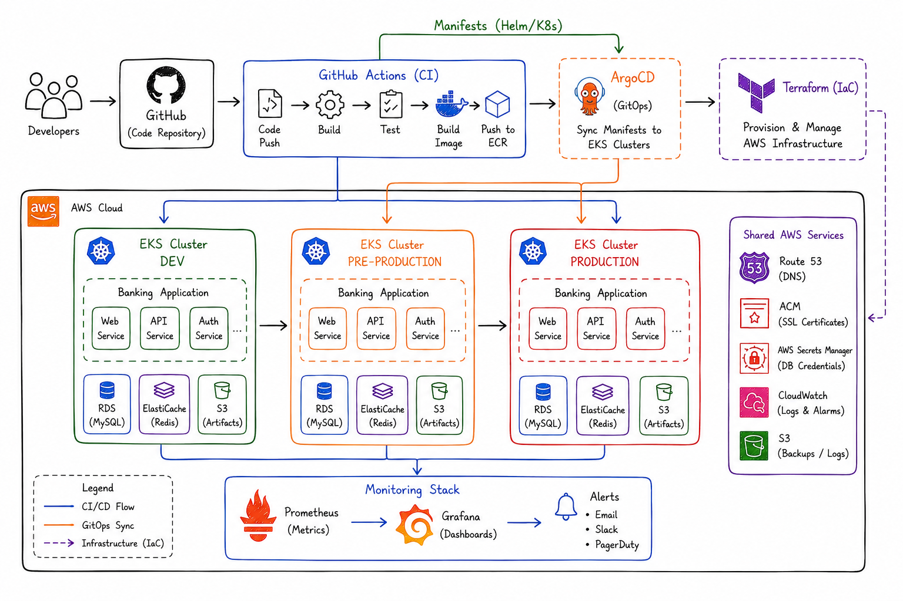

# Self Introduction & Project Q&A

## Self Introduction

My name is Sam Altman, and I am from Pune.

I am currently working as a DevOps Engineer at X Organization, and I have 3.5 years of experience in the Cloud and DevOps domain.

In my current role, my day-to-day responsibilities involve working with CI/CD pipelines. GitHub Actions is the primary tool we use to deploy multiple microservices in our project, and I am one of the key team members responsible for building and managing these CI/CD pipelines.

Apart from CI/CD, my work also includes writing Terraform code for infrastructure provisioning.

I collaborate closely with multiple development teams, and whenever there is a request for infrastructure creation or modification, I take ownership of the Terraform-related activities and ensure the infrastructure is created as per best practices.

As a DevOps Engineer, I am also responsible for containerizing applications using Docker and managing those applications using Kubernetes.

All our applications are deployed on AWS, which is our primary cloud platform. I work extensively with core AWS services and am also involved in the monitoring and observability aspects of the infrastructure and applications.

When it comes to scripting, I primarily use Shell scripting to automate tasks.

> *Add Certification details if you have any in your Introduction*

---

## Q. Explain your current project architecture?

- Currently, I am working on a healthcare project on AWS, where we follow a microservices-based architecture.
- We have multiple microservices running on AWS EKS, where each service is containerized using Docker and managed through Kubernetes.
- We maintain separate Dev, Stage, and Production environments. Each environment has its own VPC and EKS cluster to ensure security and isolation.
- Infrastructure provisioning is fully automated using Terraform with an S3 backend and DynamoDB state locking, ensuring consistency across environments.
- For monitoring and logging, we use Prometheus, Grafana, New Relic, and CloudWatch, which help with proactive issue detection and reduce downtime.
- Overall, my role mainly involves Kubernetes cluster management, CI/CD management, production support, and infrastructure management on AWS.

---

## Explain your day-to-day activities being a DevOps Engineer?

As a DevOps Engineer, my day starts around 9:30 AM by checking Slack messages and emails. We also check monitoring alerts to check for any overnight outages or deployment issues.

At 10 AM, we have our daily stand-up call where we discuss ongoing tasks and any blockers we are facing, and we plan for the day. If there is any high-priority work, we discuss it then.

After that, I directly jump to Jira tickets — Jira is the ticketing platform that we use. Tickets usually involve AWS-related tasks such as creating infra using Terraform across multiple environments like Dev, QA, Stage, and Production. I manage CI/CD pipelines, support releases, and handle deployments on EKS. A key part of my role is working on Terraform.

At the same time, as a DevOps Engineer, we don’t work only on planned activities. We also handle unplanned and urgent tasks such as production issues, failed deployments, application or infrastructure incidents, and urgent infrastructure changes. Based on the priority, I troubleshoot and resolve these issues to minimize the impact on the application and users.

After that, we have a lunch break and then...

Post-lunch, I attend a couple of meetings with developers, QA teams, and product owners. In this meeting, we plan for new service onboarding, infrastructure modifications, cost optimization, and DR setup (Disaster Recovery).

By the end of the day, I update all Jira tickets and close the ones which are completed.

If interns or new joinees are available, I provide KT (Knowledge Transfer) to them.

---

## Q. Tell me about your project

The project I'm working on is a US-based healthcare application used for managing medical appointments and related workflows — it's a microservices-based project.

As part of this project, there are multiple microservices, and I take care of infrastructure needs for those microservices.

We have deployed this project on an AWS EKS (Elastic Kubernetes Service) cluster.

All of the infrastructure for the project is managed using Terraform.

AWS is our primary cloud platform, and various core AWS services are used, including EKS, EC2, VPC, IAM, S3, ALB, RDS, etc.

For CI/CD, we use GitHub Actions as our primary automation tool.
