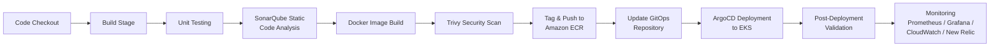
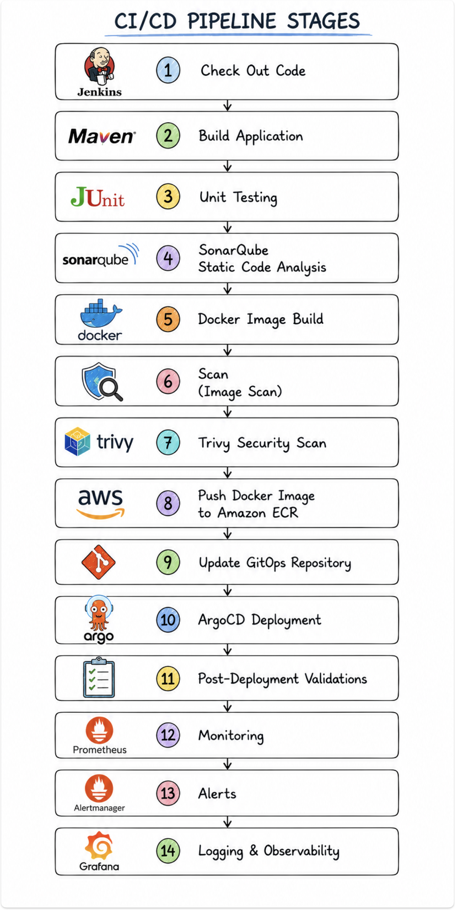

# CI/CD Pipeline & Rollback Q&A

## Q. Explain the Complete CI/CD Flow in your current project

GitHub Actions is the CI/CD tool that we are using in our project. Our CI/CD has multiple stages.

1. **Code Checkout**: GitHub Actions first checks out the latest code from the GitHub repository.
2. **Build Stage**: The application is built using tools such as `pip`, Maven (`mvn`), or `npm`, depending on the application.
3. **Unit Testing**: Unit tests are executed to validate the application's functionality (e.g., `mvn test`, `npm run test`).
4. **SonarQube Static Code Analysis**: We perform static code analysis using SonarQube to identify code quality issues, bugs, vulnerabilities, and code smells. The code must pass the SonarQube Quality Gate.
5. **Docker Image Build**: Once the code passes all validations, GitHub Actions builds the Docker image using the Dockerfile (e.g., `docker build -t company-service`).
6. **Trivy Security Scan**: The Docker image is scanned using Trivy to identify critical and high-severity vulnerabilities.
7. **Tag and Push to Amazon ECR**: After successful scanning, GitHub Actions tags and pushes the Docker image to AWS ECR.
8. **Update GitOps Repository**: After pushing the image, GitHub Actions updates the image tag in the GitOps repository, where the Helm charts are stored.
9. **ArgoCD Deployment**: ArgoCD continuously monitors the GitOps repository. Once it detects the updated image tag, it automatically syncs and deploys the application to the EKS cluster using Helm charts and a rolling deployment strategy.
10. **Post-Deployment Validation**: After deployment, we validate pod health, application endpoints, and deployment status using commands such as `kubectl get pods`, `kubectl get deployments`, `kubectl logs`, and health checks through the ALB and readiness probes.
11. **Monitoring**: Finally, we monitor the application using Prometheus, Grafana, CloudWatch, and New Relic to ensure everything is running correctly.

### CI/CD Flow Diagram





---

## How do you perform a rollback in your CI/CD pipeline?

In our project, we use GitHub Actions + ArgoCD with the GitOps approach. Whenever a new version is released, GitHub Actions builds the Docker image, pushes it to Amazon ECR, and updates the image tag in the GitOps repository. ArgoCD continuously monitors the GitOps repository and syncs the changes to the EKS cluster.

If an issue is identified after deployment, we perform a rollback using one of the following methods:

### Method 1: GitOps Rollback (Preferred)

Since ArgoCD continuously monitors the GitOps repository, we simply revert the commit that introduced the faulty deployment.

```bash
git revert <commit-id>
git push origin main
```

ArgoCD detects the reverted image tag and automatically deploys the previous stable version.

This is our preferred rollback mechanism because Git remains the single source of truth.

### Method 2: ArgoCD Rollback

We can also perform a rollback directly from the ArgoCD UI or CLI.

View the deployment history:

```bash
argocd app history <service-name>
```

Rollback to a previous revision:

```bash
argocd app rollback <service-name> <revision-id>
```

ArgoCD redeploys the selected stable version of the application.

### Method 3: Kubernetes Rollback (Emergency Rollback)

If an immediate rollback is required, we can use the Kubernetes rollout command.

```bash
kubectl rollout undo deployment <deployment-name>
```

Kubernetes rolls back the Deployment to the previous ReplicaSet, restoring the last working version of the application.

After the issue is resolved, we also update the GitOps repository to keep Git and the cluster in sync, ensuring ArgoCD does not re-sync the faulty version.
